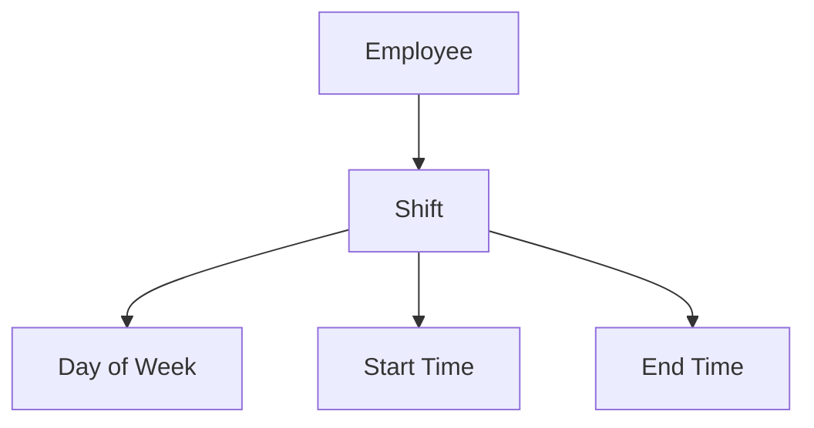
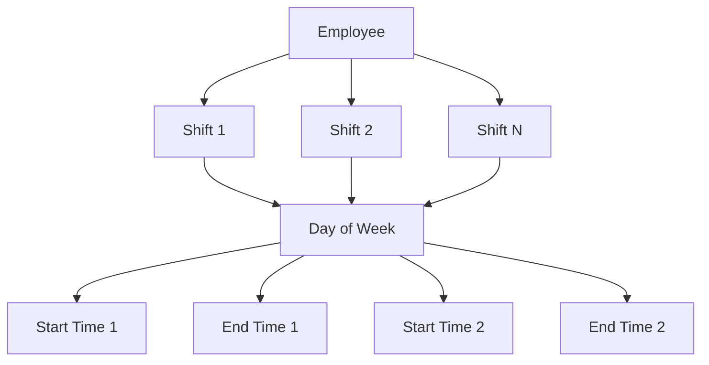

# Multiple Shifts Feature Implementation

## Overview
This feature allows employees to have multiple shifts per day while keeping the existing shift management system intact.

## Current System vs New System

### Current System (Single Shift per Day)

### New System (Multiple Shifts per Day)

## Implementation Details

### Backend
1. **New Resource**: Created `MultipleShiftsResource` that works alongside existing `ShiftResource`
2. **Data Structure**: Uses the same `shifts` database table but allows multiple entries per user/day combination
3. **Management Logic**: 
   - Load all existing shifts for a user
   - Group shifts by day of week
   - Allow adding/removing shift blocks per day
   - Handle creation, updates, and deletions appropriately

### Frontend
1. **UI Design**: Card-based layout for each day of the week
2. **Shift Blocks**: Each day can have multiple shift blocks that can be added/removed
3. **Validation**: Ensures each day has at least one shift block
4. **Responsive**: Works on different screen sizes

## Key Features
- ✅ Allows multiple shifts per day for the same employee
- ✅ Keeps existing single-shift-per-day system intact
- ✅ Uses the same database structure
- ✅ Intuitive UI for managing multiple shifts
- ✅ Proper validation and error handling
- ✅ Transactional database operations for data consistency

## How to Use
1. Navigate to "Multiple Shifts" in the Employees menu
2. Select an employee from the dropdown
3. For each day:
   - Click "Add Shift" to add additional shift blocks
   - Set start and end times for each shift
   - Click "Remove" to delete unwanted shift blocks (minimum one per day)
4. Click "Save Shifts" to persist changes

## Technical Notes
- The feature uses the existing `shifts` table without any schema changes
- All operations are wrapped in database transactions for consistency
- The system tracks which shifts were removed and deletes them appropriately
- The UI prevents removal of the last shift block for any day